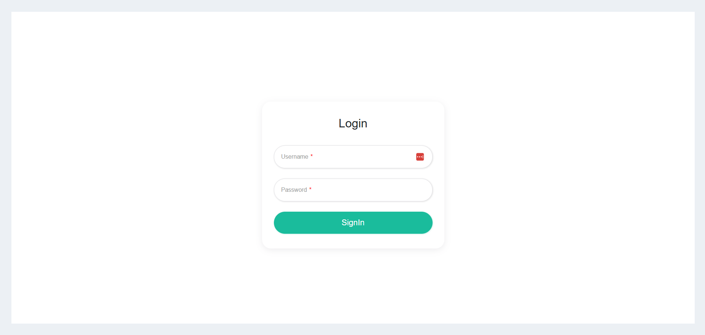
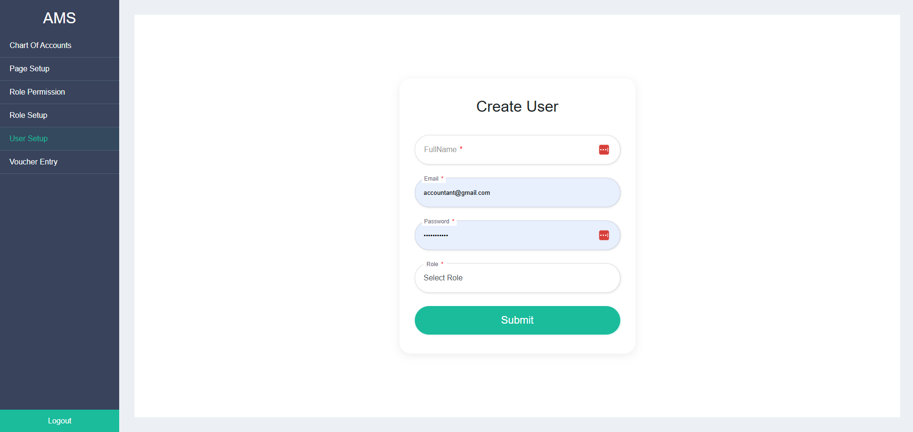
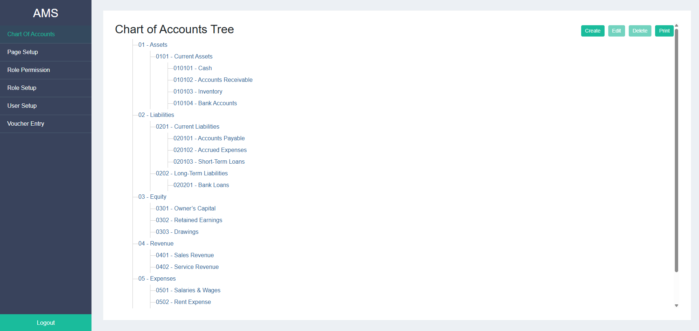
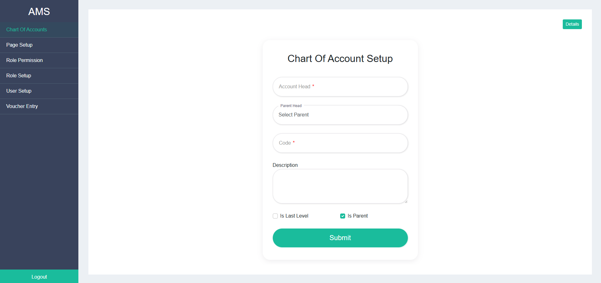
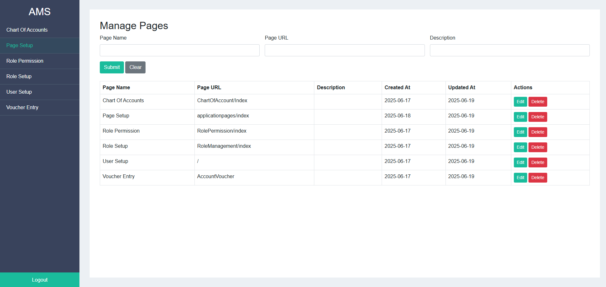
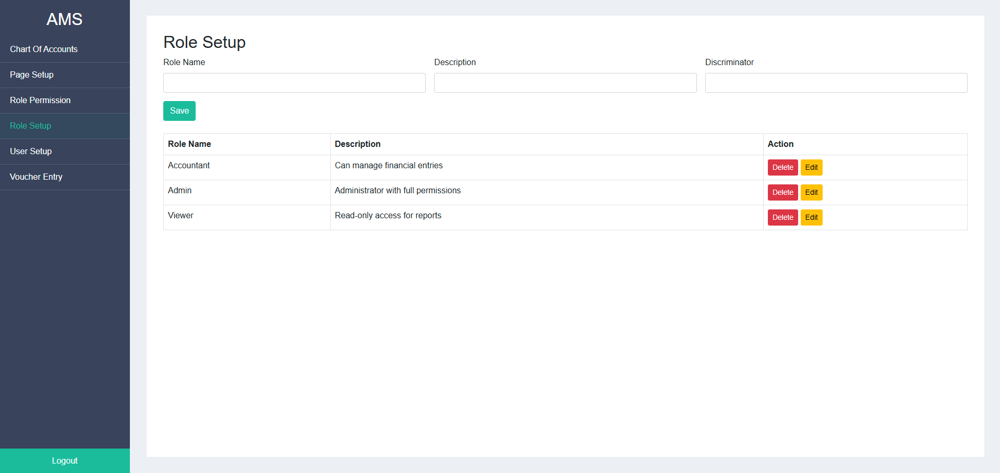
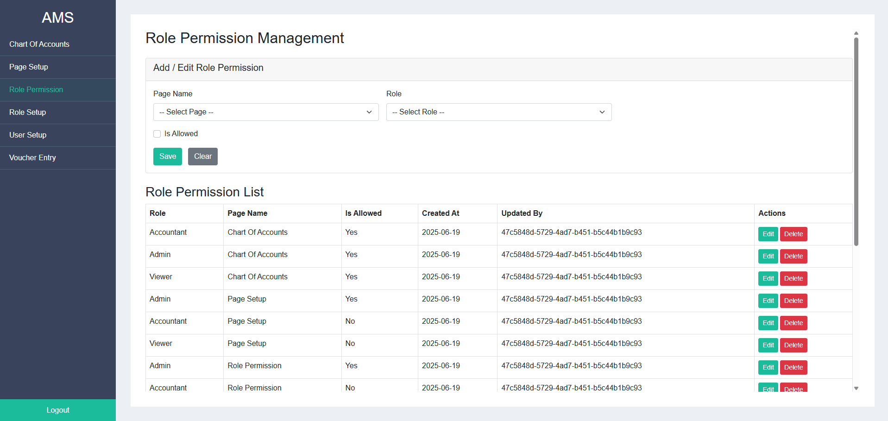
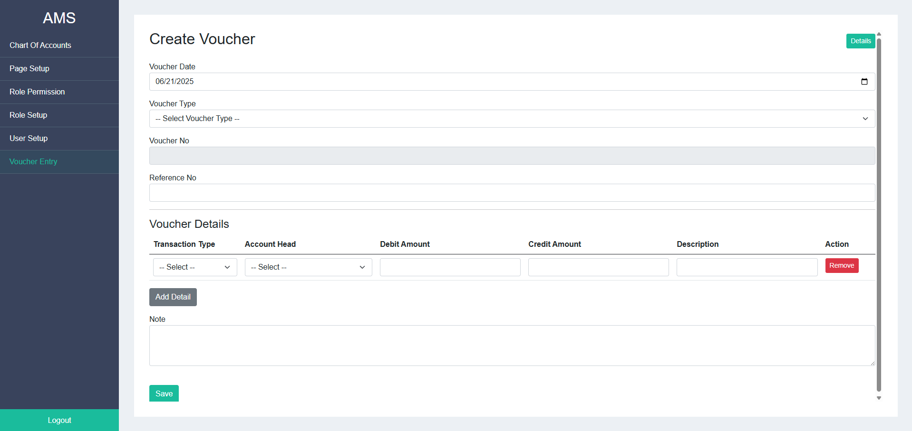
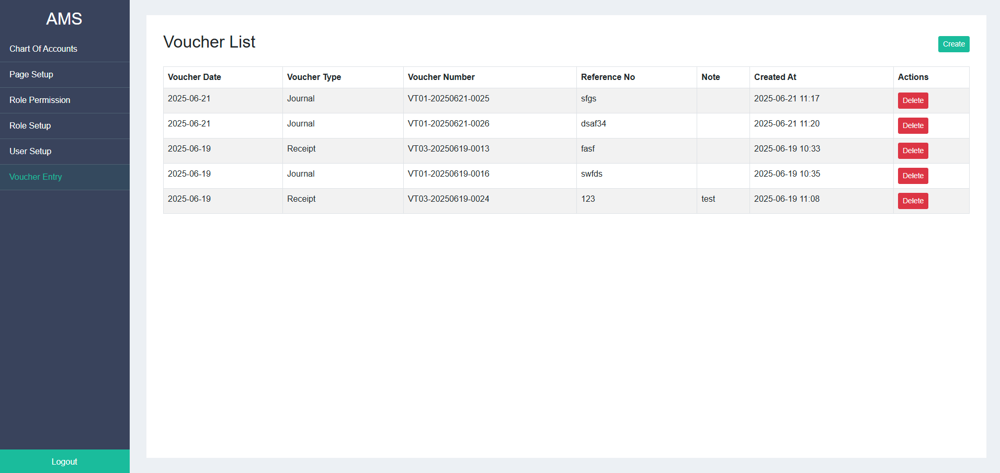

# 🧾 Mini Account Management System

A complete accounting module built using **ASP.NET Core Razor Pages**, **MS SQL Server (stored procedures only)**, and **ASP.NET Identity with custom role-based access**.

---

## 🔧 Technologies Used

- ✅ ASP.NET Core with Razor Pages
- ✅ MS SQL Server (Stored Procedures Only)
- ✅ ASP.NET Identity (with custom roles: Admin, Accountant, Viewer)
- ❌ No LINQ used

---

## 📌 Core Features

### 1. 👥 User Roles & Permissions
- Role-based authentication and authorization
- Roles: **Admin**, **Accountant**, **Viewer**
- Permission assignment via stored procedure

### 2. 🧾 Chart of Accounts
- Manage account tree with parent-child hierarchy
- CRUD operations via stored procedure: `sp_ManageChartOfAccounts`
- Example Accounts: Cash, Bank, Receivable, Payable
- Tree-view account display

### 3. 💳 Voucher Entry Module
Supports 3 types of vouchers:
- Journal Voucher
- Payment Voucher
- Receipt Voucher

Each voucher entry supports:
- Date, Reference No.
- Dynamic multiple debit/credit rows
- Account selection via dropdown
- Automatic debit-credit balance validation

---

## 🏆 Bonus Feature

- ✅ Export reports to Excel (where applicable)

---

## 🖼️ Screenshots

### 🔐 Login Page

### 👥 Create User

### 🧾 Chart of Account Tree

### ⚙️ Chart of Account Setup

### 📃 Page Setup

### 🛡️ Role Setup

### ✅ Role Permission Setup

### 💳 Create Voucher

### 📋 Voucher List

---
